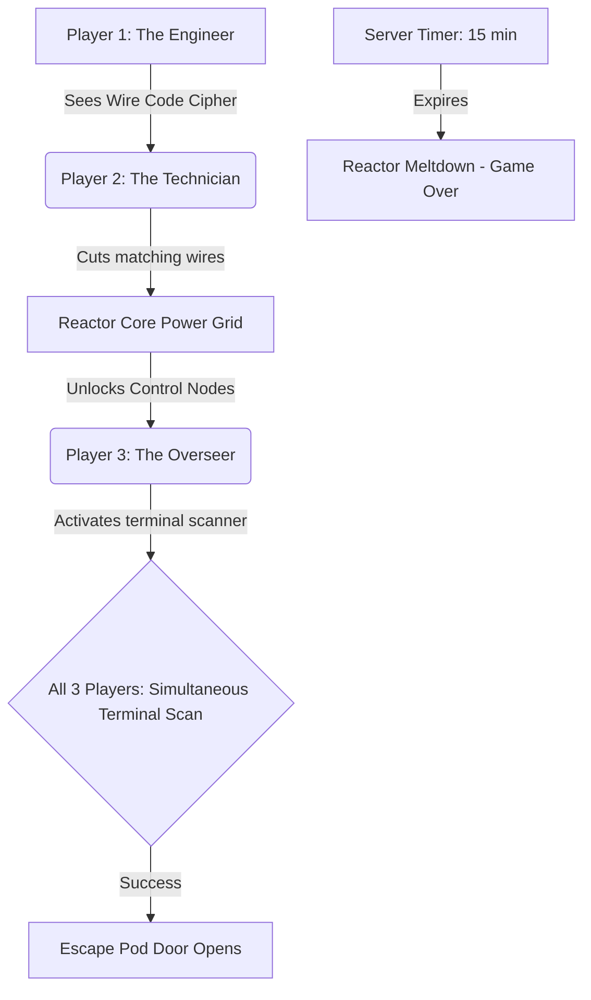
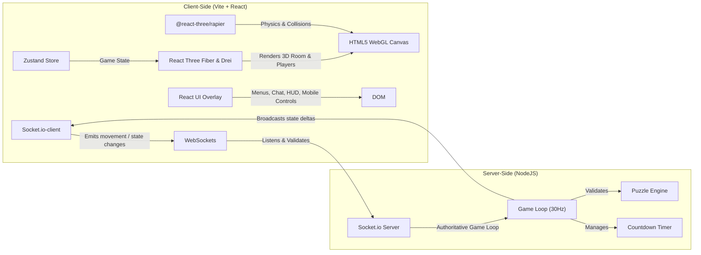

# Multiplayer 3D Co-op Escape Room Game: Research & Implementation Plan

We are building a multiplayer 3D escape room game designed for exactly 3 players (or 1 player swapping between 3 avatars). The game will center on high-cooperation puzzles requiring simultaneous actions, communication, and asymmetric information.

---

## Game Context & Co-op Rules

To make the escape room satisfying, the puzzles must enforce **interdependency**. Below is the designed concept and mechanics for our escape room, themed as **"The Sector-9 Command Deck"** (a cyberpunk reactor room).

### The Story & Room Theme
Players are lock-in operators at a decaying cyberpunk orbital command deck. A critical reactor failure is imminent. To escape via the emergency pod, they must manually override three security sub-systems. **A 15-minute countdown timer** ticks from the moment all 3 players (or solo mode begins) — if the timer expires, the reactor explodes and the game is lost.



### Puzzle Design & Coop Rules

| Puzzle Name | Cooperative Mechanics | Game Rules / Win Condition |
| :--- | :--- | :--- |
| **1. The Decoupled Power Grid** | **Asymmetric Information** | **Player 1 (Engineer)** stands near a hologram that displays a flashing color pattern of wires (e.g., Red-Blue-Green). **Player 2 (Technician)** is locked behind a security gate with a physical terminal of wire switches but cannot see the hologram. **Player 1** must voice-communicate or signal the sequence to **Player 2**, who flips the correct switches. |
| **2. The Tri-Vector Hand Scanners** | **Simultaneous Action** | Three hand-scanner terminals are placed at opposite ends of the room. All three players must walk up to their respective scanners and activate them within a **1.5-second window**. If timed incorrectly, the security grid resets and triggers a brief lockout. |
| **3. The Laser Deflection Array** | **Spatial Coordination** | A laser emitter shoots a beam from the ceiling. **Player A** operates a console to steer the emitter angle. **Player B** rotates mirror stands placed around the room to reflect the laser. **Player C** stands by the receiver target and guides them (since the target is blocked from Player A and B's views by a partition). The laser must hit the receiver to power the exit door. |

### Accessibility: Colorblind Support for Puzzle 1
Puzzle 1 relies on communicating wire colors. To support colorblind players:
- Each wire color is paired with a **unique pattern/symbol overlay** (e.g., Red = chevrons, Blue = dots, Green = stripes).
- A "Colorblind Mode" toggle in settings swaps the color labels to pattern names.

### Character Swapping (Solo Play / Playtesting)
If playing solo (or with fewer than 3 players), a player can hot-swap control between the 3 characters:
- **Desktop**: Keys `1`, `2`, and `3` switch active control, camera focus, and user input to **Player A**, **Player B**, or **Player C**.
- **Mobile**: Three large character-swap buttons at the bottom of the screen.
- Characters not under active control remain idle at their current positions.
- Example: To solve the simultaneous hand scanners solo, the player moves Player A to Scanner 1, swaps to Player B and moves them to Scanner 2, swaps to Player C and moves them to Scanner 3, then quickly triggers the activation.

---

## Technical Stack & Architecture

We will build a high-performance web-based 3D application targeting **both desktop and mobile web browsers**.



### 1. 3D Engine: **React Three Fiber (R3F)** & `@react-three/drei`
- **Why**: React Three Fiber allows us to compose Three.js elements declaratively as React components. `@react-three/drei` provides pre-built helpers (like keyboard controls, custom collision boundaries, gltf loaders, lights, and responsive canvases) which accelerate game dev.
- **Aesthetic Goals**: We will design a premium cyberpunk environment using glowing emissive neon materials, metallic panel textures, dynamic shadows, and high-tech UI overlays (glassmorphism panels).

### 2. Physics: **@react-three/rapier** (Rapier3D via WASM)
- **Why**: Required for player collision with walls/objects, Puzzle 3's laser raycasting and mirror rotation physics, and scanner proximity detection for Puzzle 2.
- **Strategy**:
  - All static room geometry (walls, floor, furniture) uses `RigidBody type="fixed"` with simplified box/hull colliders.
  - Player avatars use `RigidBody type="dynamic"` with capsule colliders.
  - Puzzle interactables use sensor colliders for proximity triggers (e.g., hand scanner activation zones).
  - Fixed physics timestep (33ms) to match server tick rate for deterministic behavior.

### 3. Networking: **Socket.io** (with Node.js server)
- **Why**: Low latency, built-in support for rooms (multiple lobby instances), and robust fallback to long-polling if WebSockets are blocked. For a 3-player cooperative puzzle game, TCP latency is acceptable — head-of-line blocking is negligible at this scale.
- **Server Authority**: The server will act as the source of truth for:
  - Lobby management (exactly 3 players per room).
  - Puzzle states (which wires are cut, whether a button is active, reactor status).
  - Player coordination updates.
  - Countdown timer.
- **Client-Side Prediction**: Player movement is predicted locally and reconciled against server state to avoid "sluggish" controls over the ~50–100ms TCP round-trip.
- **Reconnection & Resilience**:
  - 30-second grace period on disconnect — the player's slot is held.
  - On reconnect, the server sends a full state snapshot.
  - Other players see a "Player X reconnecting..." indicator.
  - Solo mode persists game state to `localStorage` for resume-on-refresh.
- **Anti-Cheat / Validation**:
  - Server validates movement speed (max velocity check, teleport detection).
  - Rate-limit socket events (max 60 inputs/sec per client).
  - Puzzle solve conditions validated server-side before broadcasting.

### 4. State Management: **Zustand**
- **Why**: R3F apps that manage game state through `useState` or prop drilling suffer severe re-render performance issues. Zustand provides direct ref-based subscriptions with no re-renders, works seamlessly with `useFrame()`, and has minimal boilerplate.
- **Store shape**:
  ```js
  useGameStore = create((set) => ({
    players: {},          // { id: { position, rotation, avatar } }
    puzzleStates: {},     // { puzzleId: { solved, progress, data } }
    activePlayerId: null, // For character swapping
    gamePhase: 'lobby',   // lobby | playing | escaped | failed
    timer: 900,           // 15 minutes in seconds, server-authoritative
    settings: {           // User preferences
      colorblindMode: false,
      reducedMotion: false,
      audioVolume: 0.7,
    },
  }))
  ```

### 5. Styling & Styling Tokens: **Vanilla CSS**
- **Why**: In accordance with the system styling guidelines, we will use modern Vanilla CSS with CSS custom properties (variables) for HSL colors, responsive grid structures, blur effects (glassmorphism), and keyframe animations for UI transitions.
- Supports `prefers-reduced-motion` media query to disable animations for users who request it.

### 6. Audio: **Drei Positional Audio** + **Howler.js**
- **3D Spatial Audio** (`@react-three/drei` `<PositionalAudio>`): Reactor hum, laser buzz, scanner beeps — positioned in 3D space and attenuated by distance.
- **UI Audio** (`howler.js`): Menu clicks, countdown tick, puzzle-solve chime, alarm klaxon, game-over explosion.
- **Progressive Intensity**: As the countdown timer drops below 5 minutes, ambient alarm frequency increases and lights begin flickering.

### 7. Mobile Web Strategy

#### Touch Controls
- **Movement**: `nipplejs` virtual joystick (HTML/CSS overlay, left side of screen).
- **Camera**: Second virtual joystick (right side) or drag-on-canvas.
- **Interaction**: Tap on 3D objects to interact (replaces click). Large "ACTIVATE" button appears contextually near interactable objects.
- **Character Swap**: Three large buttons at bottom-center of screen.

#### Puzzle-Specific Mobile Adaptations

| Puzzle | Mobile Solution |
| :--- | :--- |
| **1. Wire Grid** | When approaching the terminal, an HTML overlay panel with large toggle switches appears (avoids tiny 3D touch targets). |
| **2. Hand Scanners** | Virtual joystick for movement + contextual "SCAN" button when in proximity. |
| **3. Laser/Mirrors** | Mode toggle: "Move" vs "Interact". In interact mode, drag gestures rotate mirrors. |

#### Adaptive Rendering Quality
Detect device capability and adjust rendering to maintain 30–60 FPS:

```js
const isMobile = /Mobi|Android/i.test(navigator.userAgent)
// Also use detect-gpu library for GPU tier detection

<Canvas
  dpr={isMobile ? [1, 1.5] : [1, 2]}       // Cap pixel ratio
  shadows={!isMobile}                        // Disable real-time shadows on mobile
  gl={{ antialias: !isMobile }}              // Disable AA on mobile
/>
```

- **Desktop**: Full shadows, bloom post-processing, antialiasing, DPR up to 2.
- **Mobile**: Baked shadow textures, no bloom, no AA, DPR capped at 1.5.
- Use `<AdaptiveDpr />` and `<AdaptiveEvents />` from Drei for auto-tuning.

#### Viewport & Orientation
- Lock to landscape orientation on Android (`screen.orientation.lock('landscape')`).
- Show "Please rotate your device" overlay in portrait mode (iOS graceful fallback).
- Ensure UI overlays (chat, timer, puzzle hints) don't overlap touch control areas.

### 8. Asset Pipeline

| Concern | Solution |
| :--- | :--- |
| **3D Models** | `.glb` (binary glTF) format — universal, compact, GPU-friendly |
| **Compression** | Draco or Meshopt via `gltf-transform` CLI before bundling |
| **Textures** | KTX2/Basis Universal for GPU-compressed textures; cap at 1K–2K on mobile |
| **Loading UX** | `<Suspense>` + `useProgress()` from Drei → custom loading screen with progress bar |
| **Memory** | Call `.dispose()` on geometries/materials/textures when unloading; monitor via `renderer.info` |

---

## Proposed Changes

We will create a monorepo setup containing both client and server inside the workspace.

```text
/escape-room-game
├── /client                     # React + Three.js client
│   ├── /public
│   │   └── /models             # Compressed .glb models and KTX2 textures
│   ├── /src
│   │   ├── /components
│   │   │   ├── GameCanvas.jsx        # R3F canvas, lights, physics world, adaptive quality
│   │   │   ├── Room.jsx              # 3D room geometry, walls, floor, furniture
│   │   │   ├── Player.jsx            # Avatar with Rapier rigid body, movement, tag name
│   │   │   ├── PuzzleTerminal.jsx    # Wire board, scanner, and mirror interactables
│   │   │   ├── LaserBeam.jsx         # Raycasted laser with mirror reflections
│   │   │   ├── MobileControls.jsx    # nipplejs joysticks + contextual action buttons
│   │   │   ├── HUD.jsx               # Timer, player names, puzzle progress indicators
│   │   │   ├── LobbyScreen.jsx       # Room code entry, player list, ready-up
│   │   │   ├── LoadingScreen.jsx     # Asset loading progress bar
│   │   │   └── GameOverScreen.jsx    # Win/lose states with replay option
│   │   ├── /hooks
│   │   │   ├── useMultiplayer.js     # Socket.io connection, reconnection, state sync
│   │   │   └── usePlayerControls.js  # Unified keyboard + touch input abstraction
│   │   ├── /store
│   │   │   └── gameStore.js          # Zustand store (players, puzzles, timer, settings)
│   │   ├── /utils
│   │   │   └── adaptiveQuality.js    # Device detection, GPU tier, render quality config
│   │   ├── App.jsx                   # Main game setup, routing between screens
│   │   ├── index.css                 # Design tokens, typography, glassmorphism CSS
│   │   └── main.jsx
│   ├── package.json
│   └── vite.config.js
├── /server                     # Socket.io game server
│   ├── index.js                # Server bootstrap, socket event routing
│   ├── gameLoop.js             # 30Hz fixed-timestep authoritative game loop
│   └── puzzleEngine.js         # Puzzle state machines, validation, win conditions
│   └── package.json
├── package.json                # Root runner (runs server & client concurrently)
└── README.md
```

### Key Modules to Implement

---

#### Client — Core

#### [NEW] [client/src/index.css](file:///Users/johnmather/coding/Anti/escape%20room%20game/client/src/index.css)
Design tokens for colors, neon effects, UI overlay fonts (Orbitron/Inter), and premium cyber-aesthetic layouts. Includes `prefers-reduced-motion` overrides and mobile-responsive breakpoints.

#### [NEW] [client/src/store/gameStore.js](file:///Users/johnmather/coding/Anti/escape%20room%20game/client/src/store/gameStore.js)
Zustand store managing all client-side game state: player positions, puzzle progress, countdown timer, active character ID, game phase, and user settings (colorblind mode, reduced motion, audio volume).

#### [NEW] [client/src/utils/adaptiveQuality.js](file:///Users/johnmather/coding/Anti/escape%20room%20game/client/src/utils/adaptiveQuality.js)
Device detection and GPU tier assessment. Exports a quality config object (`{ shadows, dpr, antialias, bloom, maxLights }`) consumed by `GameCanvas.jsx`.

---

#### Client — 3D Components

#### [NEW] [client/src/components/GameCanvas.jsx](file:///Users/johnmather/coding/Anti/escape%20room%20game/client/src/components/GameCanvas.jsx)
The `@react-three/fiber` canvas hosting the Rapier physics world, 3D room, camera configurations, lights (point lights, ambient lights, spotlights), and adaptive quality settings. Wraps scene in `<Suspense>` with `<LoadingScreen />` fallback.

#### [NEW] [client/src/components/Room.jsx](file:///Users/johnmather/coding/Anti/escape%20room%20game/client/src/components/Room.jsx)
3D room geometry — walls, floor, ceiling, furniture, partitions. All static meshes use `RigidBody type="fixed"` with simplified box colliders. Loads compressed `.glb` models.

#### [NEW] [client/src/components/Player.jsx](file:///Users/johnmather/coding/Anti/escape%20room%20game/client/src/components/Player.jsx)
The player avatar (visualized as a stylish neon droid/probe or astronaut capsule) with Rapier `RigidBody type="dynamic"` capsule collider, unified input handling (keyboard + touch via `usePlayerControls`), and floating tag names. Supports client-side prediction for local player movement.

#### [NEW] [client/src/components/PuzzleTerminal.jsx](file:///Users/johnmather/coding/Anti/escape%20room%20game/client/src/components/PuzzleTerminal.jsx)
Interactive 3D meshes for pressure plates, wire boards, and mirrors that players can click/tap or stand on to interact. Uses Rapier sensor colliders for proximity detection. On mobile, wire board puzzle opens an HTML overlay with large toggle switches.

#### [NEW] [client/src/components/LaserBeam.jsx](file:///Users/johnmather/coding/Anti/escape%20room%20game/client/src/components/LaserBeam.jsx)
Raycasted laser beam with mirror reflection logic. Uses Three.js `Raycaster` to compute beam path through mirror chain. Visual beam rendered as a glowing cylinder mesh with emissive material.

---

#### Client — UI Components

#### [NEW] [client/src/components/MobileControls.jsx](file:///Users/johnmather/coding/Anti/escape%20room%20game/client/src/components/MobileControls.jsx)
Touch input overlay using `nipplejs` for dual virtual joysticks (movement + camera). Includes contextual action button ("ACTIVATE", "SCAN", "INTERACT") and character-swap buttons. Only rendered on touch-capable devices.

#### [NEW] [client/src/components/HUD.jsx](file:///Users/johnmather/coding/Anti/escape%20room%20game/client/src/components/HUD.jsx)
Heads-up display showing countdown timer (diegetic holographic style), player names/status indicators, current puzzle objective, and reconnection status banner.

#### [NEW] [client/src/components/LobbyScreen.jsx](file:///Users/johnmather/coding/Anti/escape%20room%20game/client/src/components/LobbyScreen.jsx)
Pre-game lobby: room code generation/entry, player list with avatar previews, ready-up buttons, solo mode toggle. Glassmorphism-styled panels.

#### [NEW] [client/src/components/LoadingScreen.jsx](file:///Users/johnmather/coding/Anti/escape%20room%20game/client/src/components/LoadingScreen.jsx)
Asset loading progress bar using Drei's `useProgress()`. Cyberpunk-themed with animated reactor boot-up sequence. Critical for mobile users on slower connections.

#### [NEW] [client/src/components/GameOverScreen.jsx](file:///Users/johnmather/coding/Anti/escape%20room%20game/client/src/components/GameOverScreen.jsx)
Win state: escape pod launch animation + stats (time remaining, puzzles solved). Lose state: reactor meltdown visual + retry option.

---

#### Client — Hooks

#### [NEW] [client/src/hooks/useMultiplayer.js](file:///Users/johnmather/coding/Anti/escape%20room%20game/client/src/hooks/useMultiplayer.js)
Socket.io connection management with:
- Room join/create flow.
- Client-side prediction: applies local inputs immediately, reconciles against server ticks.
- Entity interpolation: smoothly interpolates remote player positions between network updates.
- Reconnection handler: detects disconnect, shows banner, restores state from server snapshot on rejoin.
- Event throttling: batches position updates at 20Hz to reduce bandwidth.

#### [NEW] [client/src/hooks/usePlayerControls.js](file:///Users/johnmather/coding/Anti/escape%20room%20game/client/src/hooks/usePlayerControls.js)
Unified input abstraction that normalizes keyboard (WASD/arrows) and touch (nipplejs) input into a common `{ forward, strafe, turn, interact }` state object consumed by `Player.jsx`.

---

#### Server

#### [NEW] [server/index.js](file:///Users/johnmather/coding/Anti/escape%20room%20game/server/index.js)
Server bootstrap: HTTP server, Socket.io initialization, room management (create/join/leave), socket event routing to game loop, and CORS configuration. Rate-limits socket events (max 60/sec per client).

#### [NEW] [server/gameLoop.js](file:///Users/johnmather/coding/Anti/escape%20room%20game/server/gameLoop.js)
Authoritative game loop running at **30Hz fixed timestep** (33ms intervals):
1. Collect all client inputs since last tick.
2. Validate inputs (speed checks, teleport detection).
3. Apply inputs to authoritative game state.
4. Decrement countdown timer.
5. Delegate puzzle checks to `puzzleEngine.js`.
6. Broadcast full state to all clients in room (~200 bytes/tick for 3 players).
7. On timer expiry → trigger `failed` game phase.

#### [NEW] [server/puzzleEngine.js](file:///Users/johnmather/coding/Anti/escape%20room%20game/server/puzzleEngine.js)
Puzzle state machines and validation logic, separated from networking concerns:
- **Puzzle 1**: Validates wire switch sequence matches the generated cipher. Generates a new random sequence each game.
- **Puzzle 2**: Checks all 3 scanner activations occurred within a 1.5-second window. Implements lockout cooldown on failure.
- **Puzzle 3**: Validates laser beam path hits the receiver target (server-side raycasting against mirror positions).
- Orchestrates puzzle unlock chain (1 → 2 → 3 → escape pod).

---

## Verification Plan

### Automated / Integration Checks
- **Build Checks**: Ensure client and server build cleanly without errors (`npm run build` for both).
- **Sync Validation**: Open 3 browser tabs locally (`http://localhost:5173`) to verify that movement, character swapping, and puzzle state changes sync in real-time.
- **Mobile Emulation**: Test in Chrome DevTools mobile emulation (iPhone 14, Pixel 7) to verify touch controls, adaptive rendering, and responsive UI.
- **Reconnection Test**: Disconnect one tab's network (DevTools → Offline), wait 10 seconds, reconnect, and verify state restoration.

### Manual Verification
- Test character swap keys (`1`, `2`, `3`) on desktop and swap buttons on mobile to ensure focus and camera transition smoothly.
- Solve the 3 puzzle mechanics (asymmetric wires, simultaneous scanners, laser steering) both solo (via swapping) and simulated multi-tab.
- Verify countdown timer syncs across all clients and triggers game-over on expiry.
- Test colorblind mode toggle ensures Puzzle 1 is solvable without color differentiation.
- Profile mobile performance: confirm 30+ FPS on mid-tier device with `renderer.info` draw call monitoring.
- Test landscape lock on Android and portrait-mode overlay on iOS.
