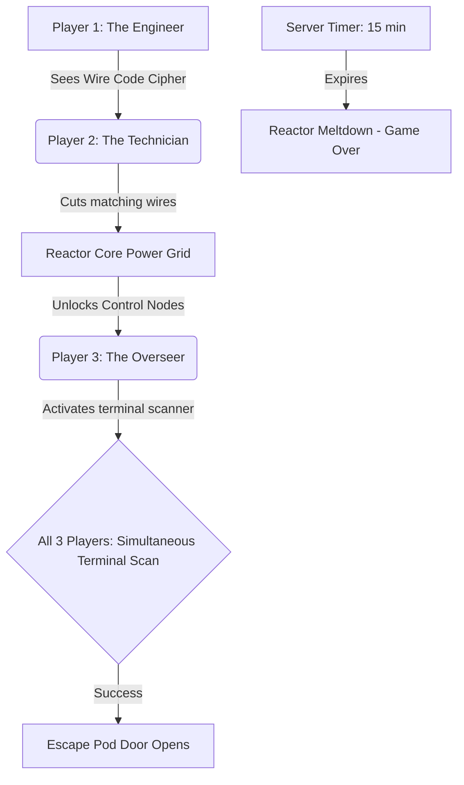
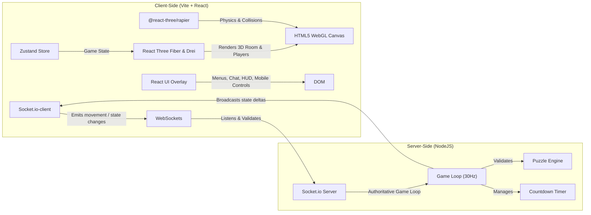

# Multiplayer 3D Co-op Escape Room Game: Research & Implementation Plan

We are building a multiplayer 3D escape room game designed for exactly 3 players (or 1 player swapping between 3 avatars). The game will center on high-cooperation puzzles requiring simultaneous actions, communication, and asymmetric information.

---

## Game Context & Co-op Rules

To make the escape room satisfying, the puzzles must enforce **interdependency**. Below is the designed concept and mechanics for our escape room, themed as **"The Sector-9 Command Deck"** (a cyberpunk reactor room).

### The Story & Room Theme
Players are lock-in operators at a decaying cyberpunk orbital command deck. A critical reactor failure is imminent. To escape via the emergency pod, they must manually override three security sub-systems. **A 15-minute countdown timer** ticks from the moment all 3 players (or solo mode begins) — if the timer expires, the reactor explodes and the game is lost.



### Puzzle Design & Coop Rules

| Puzzle Name | Cooperative Mechanics | Game Rules / Win Condition |
| :--- | :--- | :--- |
| **1. The Decoupled Power Grid** | **Asymmetric Information** | **Player 1 (Engineer)** stands near a hologram that displays a flashing color pattern of wires (e.g., Red-Blue-Green). **Player 2 (Technician)** is locked behind a security gate with a physical terminal of wire switches but cannot see the hologram. **Player 1** must voice-communicate or signal the sequence to **Player 2**, who flips the correct switches. |
| **2. The Tri-Vector Hand Scanners** | **Simultaneous Action** | Three hand-scanner terminals are placed at opposite ends of the room. All three players must walk up to their respective scanners and activate them within a **1.5-second window**. If timed incorrectly, the security grid resets and triggers a brief lockout. |
| **3. The Laser Deflection Array** | **Spatial Coordination** | A laser emitter shoots a beam from the ceiling. **Player A** operates a console to steer the emitter angle. **Player B** rotates mirror stands placed around the room to reflect the laser. **Player C** stands by the receiver target and guides them (since the target is blocked from Player A and B's views by a partition). The laser must hit the receiver to power the exit door. |

### Accessibility: Colorblind Support for Puzzle 1
Puzzle 1 relies on communicating wire colors. To support colorblind players:
- Each wire color is paired with a **unique pattern/symbol overlay** (e.g., Red = chevrons, Blue = dots, Green = stripes).
- A "Colorblind Mode" toggle in settings swaps the color labels to pattern names.

### Character Swapping (Solo Play / Playtesting)
If playing solo (or with fewer than 3 players), a player can hot-swap control between the 3 characters:
- **Desktop**: Keys `1`, `2`, and `3` switch active control, camera focus, and user input to **Player A**, **Player B**, or **Player C**.
- **Mobile**: Three large character-swap buttons at the bottom of the screen.
- Characters not under active control remain idle at their current positions.
- Example: To solve the simultaneous hand scanners solo, the player moves Player A to Scanner 1, swaps to Player B and moves them to Scanner 2, swaps to Player C and moves them to Scanner 3, then quickly triggers the activation.

---

## Technical Stack & Architecture

We will build a high-performance web-based 3D application targeting **both desktop and mobile web browsers**.



### 1. 3D Engine & Procedural Asset-Free Design: **React Three Fiber (R3F)**
- **Why**: React Three Fiber allows us to compose Three.js elements declaratively.
- **Procedural Mesh Architecture**: Rather than loading heavy external `.glb` models (which can break, fail to load, or slow down initial mobile rendering), we will build the cyberpunk Sector-9 Command Deck **procedurally** using Three.js primitive geometries (`<boxGeometry>`, `<cylinderGeometry>`, `<torusGeometry>`, etc.).
  - Walls and doors will be styled with dark metallic textures generated via canvas-backed shaders or CSS grids.
  - Interactive nodes, lasers, and holographic ciphers will use rich neon emissive materials (`MeshStandardMaterial` with high `emissive` values and intensity).
  - This guarantees **instant loads** (<20KB of code instead of >5MB of assets) and robust local testing.

### 2. Physics & Collisions: **Lightweight Custom AABB System**
- **Why**: Rapier3D is powerful but requires a heavy WebAssembly (WASM) bundle (>1.5MB) which increases load times and can fail on older mobile browsers.
- **Alternative**: We will implement a lightweight, custom **Axis-Aligned Bounding Box (AABB) and Cylinder-based collision system** in pure JS:
  - Static obstacles (walls, control tables, consoles) are defined as simple rectangular boxes.
  - Player avatars are represented as cylinders (position `(x, z)` and radius `r`).
  - Movement checks: Before moving the active player, we test if the new position overlaps any bounding boxes and slide the player along the collision plane (providing smooth movement).
  - Trigger zones (hand scanners, wire terminal) are represented as simple radial sensors (e.g. `distance < 2.0`).
  - This eliminates WASM dependencies entirely, decreases package overhead, and runs at a lockstep 60 FPS even on low-end devices.

### 3. Networking & Local-First Fallback: **Socket.io** + **Local Store Controller**
- **Why**: Low-latency multiplayer sync with a fallback to a standalone local play experience.
- **Local-First Architecture**:
  - The client will run in two modes: `local` (offline/sandbox) and `online` (multiplayer lobby).
  - In `local` mode, all state updates, puzzle evaluations, and character switching occur directly in the local Zustand store (simulating the server). This allows the game to be fully playable offline.
  - In `online` mode, the local store connects via `socket.io-client` to the server. Inputs are emitted to the server, and the server runs the game loop, returning authoritative player states and puzzle progress.
- **Server Authority**: The server validates coordinates, decrements the game timer, and manages room lobbies (exactly 3 slots per room code).
- **Client Prediction**: Local player movements are predicted instantly on-screen and corrected when the server broadcasts updates.

### 4. State Management: **Zustand**
- **Why**: R3F apps that manage game state through React state suffer severe re-render performance issues. Zustand provides direct ref-based subscriptions with no re-renders, works seamlessly with R3F's `useFrame()` hook, and has minimal boilerplate.
- **Store shape**:
  ```js
  useGameStore = create((set) => ({
    mode: 'local',        // 'local' | 'online'
    roomCode: null,       // Multiplayer room identifier
    players: {
      player1: { id: 'player1', name: 'Engineer', position: [0, 0, 0], rotation: 0, color: '#ff007f' },
      player2: { id: 'player2', name: 'Technician', position: [-3, 0, -3], rotation: 0, color: '#00f0ff' },
      player3: { id: 'player3', name: 'Overseer', position: [3, 0, -3], rotation: 0, color: '#39ff14' },
    },
    activePlayerId: 'player1', // For character swapping ('player1' | 'player2' | 'player3')
    puzzleStates: {
      wires: { solved: false, sequence: ['Red', 'Blue', 'Green'], activeSequence: [] },
      scanners: { solved: false, activeCount: 0, lastActivated: {} },
      laser: { solved: false, mirrorAngle: 0, emitterAngle: 0 },
    },
    gamePhase: 'lobby',   // lobby | playing | escaped | failed
    timer: 900,           // 15 minutes countdown (seconds)
    settings: {
      colorblindMode: false,
      reducedMotion: false,
    }
  }))
  ```

### 5. Styling & Styling Tokens: **Vanilla CSS**
- **Why**: In accordance with the system styling guidelines, we will use modern Vanilla CSS with CSS custom properties (variables) for HSL colors, responsive grid structures, blur effects (glassmorphism), and keyframe animations for UI transitions.
- Supports `prefers-reduced-motion` media query to disable animations for users who request it.

### 6. Audio: **Web Audio API + Procedural Sound Synthesis**
- **Why**: Loading multiple `.mp3` or `.wav` sound files increases load times and can hit CORS or blocking issues.
- **Alternative**: We will use a lightweight custom Web Audio synthesis utility to generate retro-futuristic sound effects procedurally:
  - **Alarm Klaxon**: Alternating low and high square waves.
  - **Laser Hum**: Constant low-frequency triangle wave with a slight filter sweep.
  - **Button Click / Chime**: High frequency sine wave with rapid exponential decay.
  - **Meltdown Explosion**: White noise generator with a lowpass filter sweep.
  - This guarantees zero audio files to download while delivering a highly responsive, custom auditory feedback system.

### 7. Mobile Web Strategy
- **Touch Controls**: Left screen side is dedicated to a virtual trackpad/joystick for character translation. Right screen side is dedicated to horizontal look controls (yaw rotation).
- **Adaptive Quality**: Auto-detects device capabilities and caps pixel ratio, disables anti-aliasing, and lowers dynamic lighting to maintain a stable 60 FPS on mobile.
- **Landscape Prompt**: Auto-lock screen interface in landscape orientation with CSS media queries. If the screen width is smaller than height, display a gorgeous custom full-screen dialog requesting the user to rotate their phone.

---

## Proposed Changes

We will create a monorepo setup containing both client and server inside the workspace.

```text
/escape-room-game
├── /client                     # React + Three.js client
│   ├── /src
│   │   ├── /components
│   │   │   ├── GameCanvas.jsx        # R3F canvas, lights, custom collision loop, adaptive quality
│   │   │   ├── Room.jsx              # 3D room geometry generated procedurally using primitives
│   │   │   ├── Player.jsx            # Avatar with custom AABB cylinder collision, movement, name tag
│   │   │   ├── PuzzleTerminal.jsx    # Wire board, scanner, and mirror interactables (proximity checks)
│   │   │   ├── LaserBeam.jsx         # Raycasted laser with mirror reflections
│   │   │   ├── MobileControls.jsx    # Virtual trackpads + contextual action buttons
│   │   │   ├── HUD.jsx               # Timer, player names, puzzle progress indicators
│   │   │   ├── LobbyScreen.jsx       # Room code entry, player list, ready-up
│   │   │   ├── LoadingScreen.jsx     # Asset loading progress bar (procedural assets)
│   │   │   └── GameOverScreen.jsx    # Win/lose states with replay option
│   │   ├── /hooks
│   │   │   ├── useMultiplayer.js     # Socket.io connection, reconnection, state sync
│   │   │   └── usePlayerControls.js  # Unified keyboard + touch input abstraction
│   │   ├── /store
│   │   │   └── gameStore.js          # Zustand store (players, puzzles, timer, settings)
│   │   ├── /utils
│   │   │   ├── physics.js            # Custom lightweight collision checking (AABB/Cylinder)
│   │   │   ├── sound.js              # Procedural Web Audio API sound generator
│   │   │   └── adaptiveQuality.js    # Device detection, GPU tier, render quality config
│   │   ├── App.jsx                   # Main game setup, routing between screens
│   │   ├── index.css                 # Design tokens, typography, glassmorphism CSS
│   │   └── main.jsx
│   ├── package.json
│   └── vite.config.js
├── /server                     # Socket.io game server
│   ├── index.js                # Server bootstrap, socket event routing
│   ├── gameLoop.js             # 30Hz fixed-timestep authoritative game loop
│   └── puzzleEngine.js         # Puzzle state machines, validation, win conditions
│   └── package.json
├── package.json                # Root runner (runs server & client concurrently)
└── README.md
```

### Key Modules to Implement

---

#### Client — Core

#### [NEW] [client/src/index.css](file:///Users/johnmather/coding/Anti/escape%20room%20game/client/src/index.css)
Design tokens for colors, neon effects, UI overlay fonts (Orbitron/Inter), and premium cyber-aesthetic layouts. Includes `prefers-reduced-motion` overrides and mobile-responsive breakpoints.

#### [NEW] [client/src/store/gameStore.js](file:///Users/johnmather/coding/Anti/escape%20room%20game/client/src/store/gameStore.js)
Zustand store managing all client-side game state: player positions, puzzle progress, countdown timer, active character ID, game phase, and user settings (colorblind mode, reduced motion, audio volume).

#### [NEW] [client/src/utils/physics.js](file:///Users/johnmather/coding/Anti/escape%20room%20game/client/src/utils/physics.js)
Pure JavaScript implementation of cylinder-vs-AABB (Axis-Aligned Bounding Box) collisions. Exports dynamic collision boundary functions that determine whether a player capsule can move to a target coordinate, and returns sliding vectors when hitting walls or props.

#### [NEW] [client/src/utils/sound.js](file:///Users/johnmather/coding/Anti/escape%20room%20game/client/src/utils/sound.js)
Procedural audio synthesizer utilizing the Web Audio API. Generates sci-fi hums, scanner sweeps, wiring crackles, ticking down clocks, and explosion effects on-the-fly, requiring zero asset files.

#### [NEW] [client/src/utils/adaptiveQuality.js](file:///Users/johnmather/coding/Anti/escape%20room%20game/client/src/utils/adaptiveQuality.js)
Device detection and GPU tier assessment. Exports a quality config object (`{ shadows, dpr, antialias, bloom, maxLights }`) consumed by `GameCanvas.jsx`.

---

#### Client — 3D Components

#### [NEW] [client/src/components/GameCanvas.jsx](file:///Users/johnmather/coding/Anti/escape%20room%20game/client/src/components/GameCanvas.jsx)
The `@react-three/fiber` canvas hosting the 3D room, camera configurations, lights (point lights, ambient lights, spotlights), and adaptive quality settings. Combines the custom physics step in the `useFrame` game loop.

#### [NEW] [client/src/components/Room.jsx](file:///Users/johnmather/coding/Anti/escape%20room%20game/client/src/components/Room.jsx)
3D room geometry — walls, floor, ceiling, decorative pipes, and partitions. Generates meshes procedurally from primitive geometry components, applying glowing neon wireframes and metallic materials.

#### [NEW] [client/src/components/Player.jsx](file:///Users/johnmather/coding/Anti/escape%20room%20game/client/src/components/Player.jsx)
The player avatar (visualized as a stylish neon droid/probe or glowing helmet capsule) with movement speed controls, collision checks against the custom physics module, keyboard/touch input handling, and floating name tag. Supports client-side prediction.

#### [NEW] [client/src/components/PuzzleTerminal.jsx](file:///Users/johnmather/coding/Anti/escape%20room%20game/client/src/components/PuzzleTerminal.jsx)
Interactive 3D meshes for pressure plates, wire boards, and mirrors that players can click/tap or stand on. Uses radial distance triggers for proximity detection. On mobile, wire board puzzle opens an HTML overlay with large toggle switches.

#### [NEW] [client/src/components/LaserBeam.jsx](file:///Users/johnmather/coding/Anti/escape%20room%20game/client/src/components/LaserBeam.jsx)
Raycasted laser beam with mirror reflection logic. Uses Three.js `Raycaster` to compute beam path through mirror chain. Visual beam rendered as a glowing cylinder mesh with emissive material.

---

#### Client — UI Components

#### [NEW] [client/src/components/MobileControls.jsx](file:///Users/johnmather/coding/Anti/escape%20room%20game/client/src/components/MobileControls.jsx)
Touch input overlay using `nipplejs` for dual virtual joysticks (movement + camera). Includes contextual action button ("ACTIVATE", "SCAN", "INTERACT") and character-swap buttons. Only rendered on touch-capable devices.

#### [NEW] [client/src/components/HUD.jsx](file:///Users/johnmather/coding/Anti/escape%20room%20game/client/src/components/HUD.jsx)
Heads-up display showing countdown timer (diegetic holographic style), player names/status indicators, current puzzle objective, and reconnection status banner.

#### [NEW] [client/src/components/LobbyScreen.jsx](file:///Users/johnmather/coding/Anti/escape%20room%20game/client/src/components/LobbyScreen.jsx)
Pre-game lobby: room code generation/entry, player list with avatar previews, ready-up buttons, solo mode toggle. Glassmorphism-styled panels.

#### [NEW] [client/src/components/LoadingScreen.jsx](file:///Users/johnmather/coding/Anti/escape%20room%20game/client/src/components/LoadingScreen.jsx)
Asset loading progress bar using Drei's `useProgress()`. Cyberpunk-themed with animated reactor boot-up sequence. Critical for mobile users on slower connections.

#### [NEW] [client/src/components/GameOverScreen.jsx](file:///Users/johnmather/coding/Anti/escape%20room%20game/client/src/components/GameOverScreen.jsx)
Win state: escape pod launch animation + stats (time remaining, puzzles solved). Lose state: reactor meltdown visual + retry option.

---

#### Client — Hooks

#### [NEW] [client/src/hooks/useMultiplayer.js](file:///Users/johnmather/coding/Anti/escape%20room%20game/client/src/hooks/useMultiplayer.js)
Socket.io connection management with:
- Room join/create flow.
- Client-side prediction: applies local inputs immediately, reconciles against server ticks.
- Entity interpolation: smoothly interpolates remote player positions between network updates.
- Reconnection handler: detects disconnect, shows banner, restores state from server snapshot on rejoin.
- Event throttling: batches position updates at 20Hz to reduce bandwidth.

#### [NEW] [client/src/hooks/usePlayerControls.js](file:///Users/johnmather/coding/Anti/escape%20room%20game/client/src/hooks/usePlayerControls.js)
Unified input abstraction that normalizes keyboard (WASD/arrows) and touch (nipplejs) input into a common `{ forward, strafe, turn, interact }` state object consumed by `Player.jsx`.

---

#### Server

#### [NEW] [server/index.js](file:///Users/johnmather/coding/Anti/escape%20room%20game/server/index.js)
Server bootstrap: HTTP server, Socket.io initialization, room management (create/join/leave), socket event routing to game loop, and CORS configuration. Rate-limits socket events (max 60/sec per client).

#### [NEW] [server/gameLoop.js](file:///Users/johnmather/coding/Anti/escape%20room%20game/server/gameLoop.js)
Authoritative game loop running at **30Hz fixed timestep** (33ms intervals):
1. Collect all client inputs since last tick.
2. Validate inputs (speed checks, teleport detection).
3. Apply inputs to authoritative game state.
4. Decrement countdown timer.
5. Delegate puzzle checks to `puzzleEngine.js`.
6. Broadcast full state to all clients in room (~200 bytes/tick for 3 players).
7. On timer expiry → trigger `failed` game phase.

#### [NEW] [server/puzzleEngine.js](file:///Users/johnmather/coding/Anti/escape%20room%20game/server/puzzleEngine.js)
Puzzle state machines and validation logic, separated from networking concerns:
- **Puzzle 1**: Validates wire switch sequence matches the generated cipher. Generates a new random sequence each game.
- **Puzzle 2**: Checks all 3 scanner activations occurred within a 1.5-second window. Implements lockout cooldown on failure.
- **Puzzle 3**: Validates laser beam path hits the receiver target (server-side raycasting against mirror positions).
- Orchestrates puzzle unlock chain (1 → 2 → 3 → escape pod).

---

## Bootstrap & Dependencies Setup

### 1. Root Configuration
We will use concurrent execution to launch both client and server development environments together:

#### [NEW] [package.json](file:///Users/johnmather/coding/Anti/escape%20room%20game/package.json)
```json
{
  "name": "escape-room-monorepo",
  "private": true,
  "scripts": {
    "install:all": "npm install && npm install --prefix client && npm install --prefix server",
    "dev": "concurrently \"npm run dev --prefix client\" \"npm start --prefix server\"",
    "build:client": "npm run build --prefix client",
    "build:server": "npm run build --prefix server"
  },
  "devDependencies": {
    "concurrently": "^8.2.2"
  }
}
```

### 2. Client Dependencies
- **Vite & React** for development & rendering.
- **Three, @react-three/fiber, @react-three/drei** for 3D graphics rendering.
- **Zustand** for direct, high-frequency state updates.
- **Socket.io-client** for real-time networking.

### 3. Server Dependencies
- **Express & CORS** for serving HTTP and handling origins.
- **Socket.io** for real-time server-side state broadcasts.

---

## Verification Plan

### Automated / Integration Checks
- **Build Checks**: Ensure client and server build cleanly without errors (`npm run build` for both).
- **Sync Validation**: Open 3 browser tabs locally (`http://localhost:5173`) to verify that movement, character swapping, and puzzle state changes sync in real-time.
- **Mobile Emulation**: Test in Chrome DevTools mobile emulation (iPhone 14, Pixel 7) to verify touch controls, adaptive rendering, and responsive UI.
- **Reconnection Test**: Disconnect one tab's network (DevTools → Offline), wait 10 seconds, reconnect, and verify state restoration.

### Manual Verification
- Test character swap keys (`1`, `2`, `3`) on desktop and swap buttons on mobile to ensure focus and camera transition smoothly.
- Solve the 3 puzzle mechanics (asymmetric wires, simultaneous scanners, laser steering) both solo (via swapping) and simulated multi-tab.
- Verify countdown timer syncs across all clients and triggers game-over on expiry.
- Test colorblind mode toggle ensures Puzzle 1 is solvable without color differentiation.
- Profile mobile performance: confirm 30+ FPS on mid-tier device with `renderer.info` draw call monitoring.
- Test landscape lock on Android and portrait-mode overlay on iOS.
